  

---

## 🧑‍💻 About Me

> *"Driven by curiosity, always seeking innovative solutions."*

I'm a **DevSecOps Engineer** based in **Lugano, Switzerland**. I moved from full-stack development to cloud-native infrastructure and never looked back.

- 🔭 Running a **Homelab Kubernetes cluster** where mistakes are welcome (it's called learning)
- 🏅 **CKA · CKAD · KCNA · KCSA** · Sysdig Kraken Hunter · Snyk Certified Technical Professional
- 🤖 Benchmarking **frontier models** and running **local LLMs** (llama.cpp, Ollama, DGX Spark) on my own hardware
- 🎤 Speaker at **Linux Day Avellino 2024**
- 📝 I write about DevOps, cloud-native, and AI at [alfonsofortunato.com](https://alfonsofortunato.com)

---

## 🚢 How I Ship

---

## 🛠️ Tech Stack

   
   
  

  
  
  
  
  
  
  
  

---

## 🚀 Featured Projects

| Project | Description | Stars |
|---------|-------------|:-----:|
| [devpod-dotfiles-chezmoi](https://github.com/MovieMaker93/devpod-dotfiles-chezmoi) | Cross-platform dotfiles for Zsh, Tmux, Neovim & Bitwarden — works on workstations, DevPods, and DevContainers | ⭐ 25 |
| [homelab-k8s](https://github.com/MovieMaker93/homelab-k8s) | My Homelab Kubernetes playground — where mistakes are the curriculum | ⭐ 3 |
| [note-cli](https://github.com/MovieMaker93/note-cli) | CLI for Zettelkasten-style notes, integrating Neovim & Obsidian | ⭐ 2 |
| [telescope-ghissue.nvim](https://github.com/MovieMaker93/telescope-ghissue.nvim) | Neovim Telescope plugin for browsing GitHub issues in-editor | ⭐ 1 |

---

## 🤖 AI & LLM Interests

- **Frontier models:** Claude, GPT, Gemma, Mistral. I test them on real workflows, not just benchmarks
- **Local inference:** RTX 4070 Ti and a DGX Spark running llama.cpp and Ollama (DeepSeek V4 Flash, GLM, Gemma 4, Laguna)
- **PKM + AI:** a personal knowledge base powered by LLMs (Obsidian + local search + Claude Code)
- **DevSecOps meets AI:** exploring how LLMs fit into CI/CD pipelines and developer workflows

---

## 📝 Latest from the Blog

<!-- BLOG-POST-LIST:START -->
- [DeepSeek V4 Flash vs GLM 5.3 Flash: Who Wins on a Single Spark?](https://alfonsofortunato.com/blog/deepseek-v4-flash-vs-glm-5-3-flash-who-wins-on-a-single-spark)
- [DeepSeek V4 Flash on a Single DGX Spark](https://alfonsofortunato.com/blog/deepseek-v4-flash-on-a-single-dgx-spark)
- [Running Laguna S 2.1 on a DGX Spark](https://alfonsofortunato.com/blog/running-laguna-s2-1-on-dgx-spark)
- [My Obsidian PKM Setup: Karpathy's LLM Wiki + Claude Code + Local Search](https://alfonsofortunato.com/blog/obsidian-pkm-llm-wiki)
- [Gemma 4 E4B vs 26B on an RTX 4070 Ti: Benchmarks, RAG, and a Real Webapp Test](https://alfonsofortunato.com/blog/gemma-4-e4b-vs-26b-local-benchmarks)
<!-- BLOG-POST-LIST:END -->

---

## 📊 GitHub Stats

  
  

  

  

  <picture>
    <source media="(prefers-color-scheme: dark)" srcset="https://raw.githubusercontent.com/MovieMaker93/MovieMaker93/output/github-snake-dark.svg" />
    <source media="(prefers-color-scheme: light)" srcset="https://raw.githubusercontent.com/MovieMaker93/MovieMaker93/output/github-snake.svg" />
    
  </picture>

---

## ⚡ Recent GitHub Activity

<!--START_SECTION:activity-->
1. 🗣 Commented on [#40](https://github.com/ashhart/TensorFold/pull/40#issuecomment-5869173037) in [ashhart/TensorFold](https://github.com/ashhart/TensorFold)
<!--END_SECTION:activity-->

---

  

